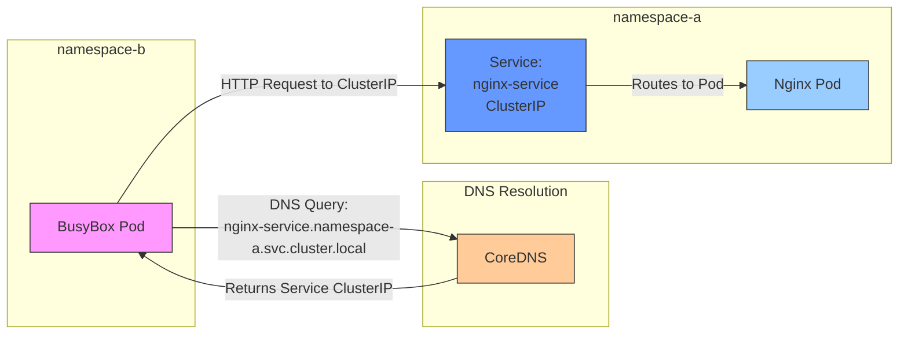

# 🌐 Kubernetes Cross-Namespace Communication Explorer

[](https://github.com/TheToriqul/k8s-cross-namespace-access)


## 📋 Project Overview

This project demonstrates advanced Kubernetes networking capabilities by implementing cross-namespace Pod communication. Through practical implementation, I've explored how to break down the default namespace isolation in Kubernetes while maintaining security and control. The project showcases real-world scenarios where services need to communicate across namespace boundaries, a common requirement in microservices architectures.

## 🎯 Key Objectives

- Implement secure cross-namespace communication in Kubernetes
- Deploy and manage resources across multiple namespaces
- Configure and validate service discovery using Kubernetes DNS
- Demonstrate practical usage of Kubernetes networking concepts
- Create a reproducible example of microservices communication patterns

## 🏗️ Project Architecture



The architecture demonstrates how a BusyBox Pod in `namespace-b` can communicate with an Nginx service in `namespace-a` using Kubernetes DNS resolution.

## 💻 Technical Stack

- **Container Platform**: Kubernetes
- **Container Runtime**: Docker
- **Web Server**: Nginx
- **Testing Tool**: BusyBox
- **Service Discovery**: Kubernetes DNS

## 🚀 Getting Started

<details>
<summary>🐳 Prerequisites</summary>

- Kubernetes cluster (local or cloud-based)
- kubectl CLI tool
- Basic understanding of Kubernetes concepts
- vim text editor (for YAML file editing)

</details>

<details>
<summary>⚙️ Installation</summary>

1. Clone the repository:
   ```bash
   git clone https://github.com/TheToriqul/k8s-cross-namespace-access.git
   ```
2. Navigate to the project directory:
   ```bash
   cd k8s-cross-namespace-access
   ```
3. Install required tools:
   ```bash
   sudo apt update && sudo apt install vim -y
   ```

</details>

<details>
<summary>🎮 Usage</summary>

1. Create the required namespaces:
   ```bash
   kubectl create namespace namespace-a
   kubectl create namespace namespace-b
   ```

2. Deploy Nginx components:
   ```bash
   kubectl apply -f nginx-deployment.yaml
   kubectl apply -f nginx-service.yaml
   ```

3. Deploy BusyBox pod:
   ```bash
   kubectl apply -f busybox.yaml
   ```

For detailed commands and explanations, refer to the [reference-commands.md](reference-commands.md) file.

</details>

## 💡 Key Learnings

### Technical Mastery:

1. Kubernetes namespace isolation mechanisms
2. Cross-namespace service discovery patterns
3. Kubernetes DNS naming conventions
4. Service networking in multi-namespace environments
5. Container deployment across isolated namespaces

### Professional Development:

1. Microservices communication patterns
2. Security considerations in service mesh architectures
3. Debugging cross-namespace connectivity
4. Infrastructure documentation best practices
5. DevOps workflow optimization

## 🔄 Future Enhancements

<details>
<summary>View Planned Improvements</summary>

1. Implement network policies for fine-grained access control
2. Add monitoring and logging capabilities
3. Create Helm charts for easier deployment
4. Implement service mesh integration
5. Add automated testing scripts
6. Create CI/CD pipeline for automated deployment

</details>

## 📧 Connect with Me

- 📧 Email: toriqul.int@gmail.com
- 📱 Phone: +65 8936 7705, +8801765 939006
- 🌐 LinkedIn: [@TheToriqul](https://www.linkedin.com/in/thetoriqul/)
- 🐙 GitHub: [@TheToriqul](https://github.com/TheToriqul)
- 🌍 Portfolio: [TheToriqul.com](https://thetoriqul.com)

Let's connect and discuss Kubernetes, cloud-native technologies, and beyond!

## 👏 Acknowledgments

- [Poridhi](https://devops.poridhi.io/) for providing comprehensive learning resources
- The Kubernetes community for excellent documentation
- Fellow developers who provided valuable feedback and suggestions

---

Thank you for exploring this project! I hope it helps you understand Kubernetes cross-namespace communication better. Star the repository if you found it useful! 🌟